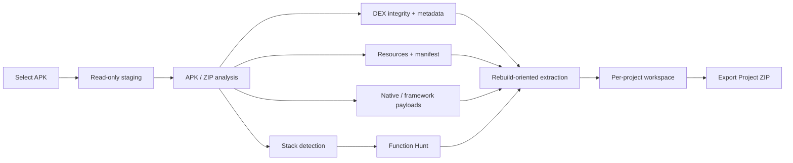

<div align="center">

# BG Gremlin APK Recovery

### Android disaster recovery, reconstruction, and rebuild-oriented extraction

**Background Gremlin Group**  
*don't do evil*


**Preserve the APK. Find the logic. Recover everything that survived. Export a rebuild workspace.**

</div>

---

BG Gremlin APK Recovery is an **offline Android APK disaster-recovery toolkit** built for situations where the original project is damaged, incomplete, inaccessible, or gone.

It does not treat an APK as a black box to summarize. It treats it as a recovery source.

The application preserves the original package, identifies the application stack, evaluates likely obfuscation, locates recoverable logic, extracts rebuild-relevant artifacts, inventories native and framework payloads, and exports a deterministic recovery project that can be worked from directly.

> **Core rule:** if code or metadata still exists in the APK, preserve it — even when names are obfuscated, structure is ugly, or reconstruction is incomplete.

---

## What it actually recovers

| Area | Recovery output |
|---|---|
| **Original APK** | Exact untouched copy of the analyzed package |
| **APK filesystem** | Complete non-directory ZIP tree with traversal-safe extraction |
| **DEX bytecode** | Every `classes*.dex` file preserved byte-for-byte |
| **DEX strings** | Complete decoded DEX string tables |
| **DEX classes** | Class descriptors and surviving source-file metadata |
| **DEX methods** | Method IDs, classes, names, prototypes, and access metadata |
| **Dalvik code** | Exact original 16-bit instruction code units for reachable `code_item` entries |
| **Obfuscated code** | Preserved exactly as encoded instead of being filtered out |
| **Android resources** | `AndroidManifest.xml`, `resources.arsc`, and packaged resources |
| **Source-like files** | Java, Kotlin, C#, Dart, JS, TS, HTML, CSS, SQL, maps, config, and other surviving text |
| **Framework payloads** | Flutter, React Native/Hermes, Unity, Xamarin/.NET, Cordova/Capacitor, Godot |
| **Native code** | ABI-separated `.so` libraries plus printable binary evidence |
| **Name recovery** | R8/ProGuard mappings, source maps, symbols, PDB/MDB/debug artifacts when present |
| **Reports** | TXT, HTML, JSON, CSV inventories, checksums, and project metadata |

Obfuscation does **not** make code disposable. If R8/ProGuard or another tool has renamed classes and methods, BG Gremlin APK Recovery keeps those identifiers and the underlying executable evidence exactly as shipped.

What it does **not** do is fabricate original names, comments, Git history, or source files that no longer exist.

---

## Recovery pipeline



The source APK is treated as evidence. Recovery happens into a separate project workspace.

---

## One APK, one recovery-project root

Every recovery workspace uses its own deterministic SHA-qualified root. In v1.5.2 Android user-facing exports, this root is packaged inside the ZIP chosen through the native save flow:

```text
<apk-name>_<first-12-sha256>/
        ├── raw_apk/
        │   ├── original.apk
        │   └── tree/
        │
        ├── rebuild/
        │   ├── AndroidManifest.xml
        │   ├── resources/
        │   ├── dex/
        │   │   ├── classes*.dex
        │   │   ├── *.strings.txt
        │   │   ├── *.classes.tsv
        │   │   ├── *.methods.tsv
        │   │   └── *.code-items.txt
        │   └── REBUILD_GUIDE.txt
        │
        ├── recovered_sources/
        ├── framework_payloads/
        ├── native/
        ├── obfuscation/
        ├── binary_evidence/
        ├── reports/
        ├── inventories/
        ├── checksums/
        └── project_manifest.json
```

This keeps output from separate APK byte streams isolated and makes exported projects reproducible by source SHA-256. The app may assemble this workspace in app-private storage before packaging, but that staging path is never presented as the final user-visible export.

See **[Recovery Output Contract](docs/RECOVERY_OUTPUT.md)** for the complete layout.

---

## Supported application stacks

| Stack | Detection | Recovery focus |
|---|:---:|---|
| Native Android / Java / Kotlin | ✓ | DEX, resources, manifest, assets |
| Jetpack Compose | ✓ | DEX, Compose classes, resources |
| Godot Engine | ✓ | PCK/resources, compiled scripts, Android bridge |
| Flutter | ✓ | `libapp.so`, Flutter assets, snapshots/kernel artifacts |
| React Native / Hermes | ✓ | JS/Hermes bundles, source maps, native modules |
| Unity Mono | ✓ | Managed assemblies, metadata, assets |
| Unity IL2CPP | ✓ | `global-metadata.dat`, `libil2cpp.so`, serialized data |
| Xamarin / .NET MAUI | ✓ | Managed assemblies/stores, symbols, native bridge |
| Cordova / Ionic / Capacitor | ✓ | Packaged web application, source maps, plugins |
| Native-heavy APKs | ✓ | JNI bridges, ELF libraries, binary evidence |

---

## Function Hunt

Function Hunt is designed for the situation where you remember **behavior**, not structure.

Searches include:

- DEX class descriptors
- DEX method names
- DEX string tables
- packaged filenames
- source/text assets
- case-insensitive ASCII remnants in binary payloads
- UTF-16LE remnants in native and binary files

Useful search targets include function names, URLs, log text, preference keys, API paths, exception strings, UI text, feature names, and other behavioral anchors.

---

## DEX recovery

The DEX parser validates and inventories:

- DEX magic and version
- declared file size
- header size
- endian tag
- SHA-1 header signature
- Adler-32 checksum
- string, type, method, and class tables
- table bounds
- encoded class data
- reachable method `code_item` structures

For encoded methods, the recovery export records:

- method index
- direct / virtual classification
- class descriptor
- method name
- prototype descriptor
- access flags
- `code_off`
- register count
- input/output register counts
- try block count
- debug-info offset
- instruction count
- **exact original 16-bit Dalvik code units**

That output remains useful even when readable symbol names have been destroyed by obfuscation.

The original `classes*.dex` files are always preserved alongside these decoded inventories and remain the authoritative bytecode source.

---

## Diagnostics

BG Gremlin APK Recovery also performs packaging and structural checks that are useful before attempting reconstruction:

- DEX structural and integrity validation
- duplicate Android provider-authority detection
- APK Signing Block scheme markers
- JAR/v1 signature metadata detection
- ZIP entry alignment checks
- ZIP64 parsing
- native ABI inventory
- application category / `isGame`
- package, version, min SDK, and target SDK
- recoverable artifact classification
- likely R8/ProGuard-style obfuscation estimation

Static signing diagnostics are intentionally distinguished from cryptographic verification. Release validation uses Android Build Tools such as `apksigner` and `zipalign`.

---

## Export modes

### Export Full Recovery Project ZIP

Opens Android's native save flow and writes the complete recovery project as a portable ZIP to the user-selected destination. The ZIP contains the full SHA-qualified recovery workspace, including the untouched APK, complete packaged tree, DEX rebuild evidence, recovered source/text artifacts, framework payloads, native binaries, reports, inventories, checksums, and rebuild guidance.

### Export Project ZIP

The secondary project-ZIP action packages the same complete recovery workspace for archiving or transfer to a workstation.

On Android, `content://` destinations are handled through internal staging and stream copy-out. App-private `user://` storage is an internal working area only; v1.5.2 never reports a user-facing export as successful after silently redirecting it there.

---

## Portrait-only by design

The Android application is intentionally portrait-only.

```text
Godot project: display/window/handheld/orientation = 1
Runtime:       DisplayServer.SCREEN_PORTRAIT
Android:       portrait activity orientation
```

The UI is designed around a vertical analysis and recovery workflow rather than a rotated desktop layout.

---

## Build

Requirements:

- Godot **4.7.2 stable**
- matching Godot 4.7.2 Android export templates
- JDK 17
- Android SDK Platform 36
- Android Build Tools 36.x
- Android Platform Tools

Package:

```text
org.backgroundgremlin.apkrecovery
```

Current release:

```text
Version:      1.5.2
Version code: 152
```

Full instructions: **[BUILDING.md](BUILDING.md)**

The repository intentionally uses **no GitHub Actions workflows**. Builds and release validation are performed locally.

---

## Repository map

```text
.
├── README.md
├── BUILDING.md
├── CHANGELOG.md
├── CONTRIBUTING.md
├── SECURITY.md
│
├── docs/
│   ├── ARCHITECTURE.md
│   └── RECOVERY_OUTPUT.md
│
├── release/
│   ├── v1.5.1/
│   └── v1.5.2/
│
└── source/
    └── project/
        ├── analyzer.gd
        ├── main.gd
        ├── main.tscn
        ├── project.godot
        ├── export_presets.cfg
        ├── addons/
        └── scripts/
```

This public repository contains the sanitized public source and documentation only. Private development history, historical signing material, credentials, and internal-only artifacts are not mirrored here.

---

## What recovery cannot recreate

An APK is a compiled delivery artifact, not a source-control archive.

If the following information was removed before packaging, it cannot be reconstructed from bytes that are no longer present:

- deleted comments
- Git history
- original branch structure
- source-only documentation
- build-system files never shipped
- pre-obfuscation identifiers without surviving mappings
- signing private keys
- developer-local configuration

BG Gremlin APK Recovery handles that boundary explicitly: **preserve what exists, decode what can be decoded, and never substitute invented source for missing evidence.**

---

## Security model

The selected APK is treated as **untrusted data**, not something to execute.

The recovery path is designed to:

- avoid executing packaged application code;
- sanitize extracted paths;
- prevent ZIP path traversal;
- bounds-check parser reads;
- preserve original bytes when higher-level parsing is incomplete;
- keep signing secrets out of the repository and application;
- separate source APK evidence from recovery output.

See **[SECURITY.md](SECURITY.md)** for repository and signing policy.

---

## Documentation

- **[Building](BUILDING.md)**
- **[Architecture](docs/ARCHITECTURE.md)**
- **[Recovery Output Contract](docs/RECOVERY_OUTPUT.md)**
- **[Changelog](CHANGELOG.md)**
- **[Security Policy](SECURITY.md)**
- **[Contributing](CONTRIBUTING.md)**
- **[Engineering Agent Contract](AGENTS.md)**
- **[Release Gates](docs/RELEASE_GATES.md)**
- **[Current Handoff](docs/HANDOFF.md)**
- **[v1.5.2 Release Record](release/v1.5.2/README.md)**
- **[v1.5.1 Release Record](release/v1.5.1/README.md)**

---

## Project status

**v1.5.2** is the current public source/release line.

The current implementation includes portrait-only Android operation, project-isolated exports, exact DEX preservation, Dalvik code-item extraction, framework-aware recovery, native evidence extraction, Function Hunt, diagnostics, machine-readable inventories, and complete project ZIP export through Android's native save flow.

The v1.5.2 static build/package validation record is complete. Physical Android user-visible export acceptance is tracked separately and is not implied by static, headless, or package-level checks. See **[Current Handoff](docs/HANDOFF.md)** and **[Release Gates](docs/RELEASE_GATES.md)**.

---

<div align="center">

### Background Gremlin Group

**Build defensively. Recover precisely. Don't do evil.**

</div>
